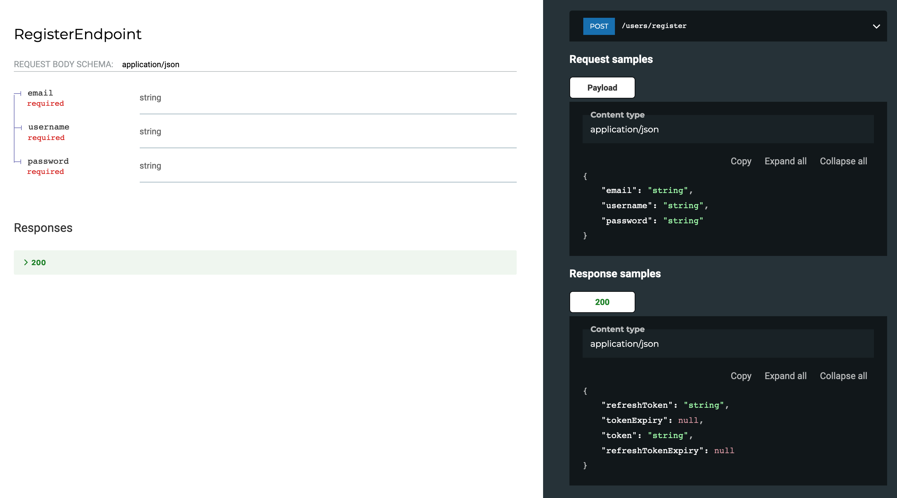

# Chill 🍦
More Convention, Less Code.

Build your Vapor API endpoint as structs that conform to a protocol. Automatically gain:
- Generate OpenAPI Documentation
- Generate Swift API Client Code
- Automatically decode the params/query/body before your core API logic begins
- Test your endpoints as strongly typed units, rather than integrations with the HTTP protocol

### Under heavy development. 

## Using this library
1. Install it as a swift package dependency of your Vapor API
2. Follow the instructions below for designing your API
3. Use the CLI to generate api documentation or api client
	- check this repo out locally
	- run `make install` from the directory
	- run `chill --help` for more instructions

## implementation

### Conform to this protocol and the magic happens:

The buildAndRun function has a default implementation, so you are mostly responsible for  `run(context:parameters:query:body:)` 
```swift
public protocol APIRoutingEndpoint {
    
    associatedtype Context: APIRoutingContext
    associatedtype Parameters
    associatedtype Query
    associatedtype Body
    associatedtype Response: ResponseEncodable
    
    static var method: APIRoutingHTTPMethod { get }
    static var path: String { get }
    
    static func buildAndRun(from request: Request) throws -> EventLoopFuture<Response>
    static func run(
        context: Context,
        parameters: Parameters,
        query: Query,
        body: Body
    ) throws -> EventLoopFuture<Response>
}
```


### Example with Params and Query
```swift
import APIRouting

struct SearchByUsernameEndpoint: APIRoutingEndpoint {
    
    struct SearchParams: Decodable {
        var username: String
    }
    
    struct SearchQuery: Decodable {
        var limit: Int
        var offset: Int
    }
    
    static var method: APIRoutingHTTPMethod = .get
    static var path: String = "/users/search/:username"
    
    static func run(
        context: AuthDatabaseRoutingContext,
        parameters: SearchParams,
        query: SearchQuery,
        body: Void
    ) throws -> EventLoopFuture<[UserViewModel]> {
        // ...
    }
}
```

### Example with body
```swift
import APIRouting

struct RegisterEndpoint: APIRoutingEndpoint {
    
    struct RegisterRequest: Decodable {
        var email: String
        var username: String
        var password: String
    }
    
    static var method: APIRoutingHTTPMethod = .post
    static var path: String = "/users/register"
    
    static func run(
        context: AuthDatabaseRoutingContext,
        parameters: Void,
        query: Void,
        body: RegisterRequest
    ) throws -> EventLoopFuture<AuthResponse> {
     // ....
    }
}

```

## Autogen documentation as you do your development by configuring routes like these:

```swift
import SwaggerDocumentationGenerator
import APIRouting

app.get("api-docs", "json") { (request) -> JSONString in
    let filePath = #file
    var readUrl = URL(fileURLWithPath: filePath)
    readUrl.deleteLastPathComponent()
    do {
        let jsonString = try DocumentationGenerator.generateOpenAPIJSONString(apiDirectoryUrl: readUrl)
        return JSONString(value: jsonString)
    } catch {
        throw error
    }
}

app.get("api-docs") { (request) -> HTML in
    let html = HTML(value:
       """
       <!DOCTYPE html>
       <html>
         <head>
           <title>ReDoc</title>
           <!-- needed for adaptive design -->
           <meta charset="utf-8"/>
           <meta name="viewport" content="width=device-width, initial-scale=1">
           <link href="https://fonts.googleapis.com/css?family=Montserrat:300,400,700|Roboto:300,400,700" rel="stylesheet">
           <!--
           ReDoc doesn't change outer page styles
           -->
           <style>
             body {
               margin: 0;
               padding: 0;
             }
           </style>
         </head>
         <body>
           <redoc spec-url='/api-docs/json'></redoc>
           <script src="https://cdn.jsdelivr.net/npm/redoc@next/bundles/redoc.standalone.js"> </script>
         </body>
       </html>
       """)
    return html
}

```

### Get docs like this for free


